개발자 기술 면접 : https://github.com/JaeYeopHan/Interview_Question_for_Beginner

주니어 개발자 채용 정보 : https://github.com/jojoldu/junior-recruit-scheduler

원격 근무 회사 : https://github.com/milooy/remote-or-flexible-work-company-in-korea

빔 훈련하기 게임 : https://vim-adventures.com/

백엔드 개발자를 꿈꾸는 학생개발자에게 : https://d2.naver.com/news/3435170

좋은 git 커밋 메시지를 작성하기 위한 7가지 약속 : https://meetup.toast.com/posts/106


* 이렇게 해놓으면 private으로 올려도 contribution이 뜬다. 

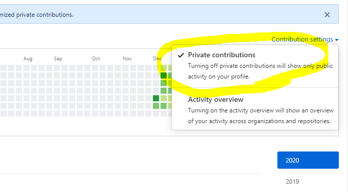


# Git

* DVCS (분산형 버전 관리 시스템)

* 만든 사람 : 리누스 토발즈


* `git status` 의 중요성

  GUI(Graphic User Interface) VS CLI(command Line Interface)

  gui는 오류가 생기면 즉각적으로 알 수 있지만, CLI에서는 오류가 생기면 즉각적으로 알 수 없다. 따라서 git status 를 통해 상태를 파악해야 한다.

  `ls` 를 통해 파일 목록을 볼 수 있고, 숨김폴더까지 보려면 `ls -al` 을 한다.

* 흐름

  **WD(working Directory)** --`add`--> **Staging area** --`commit`--> **Commitversion**

---


git으로 관리하고 있는 디렉토리인지 확인하기

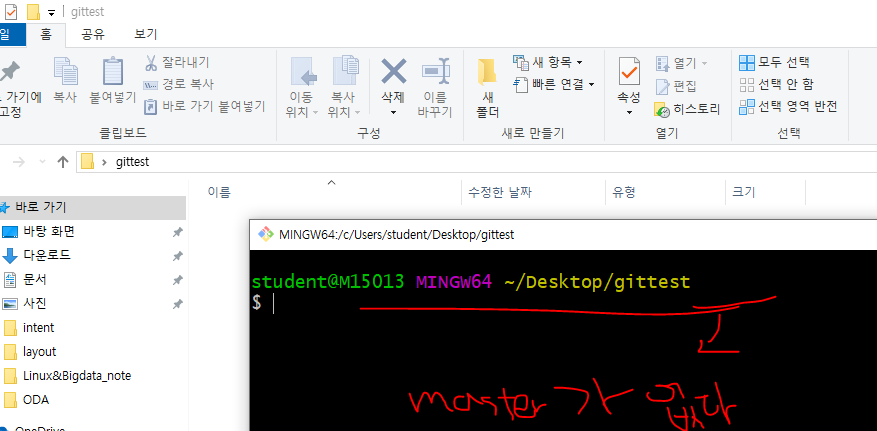


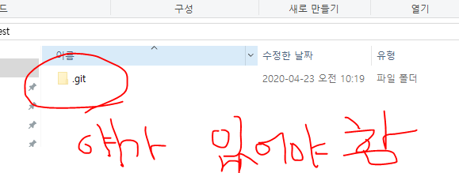


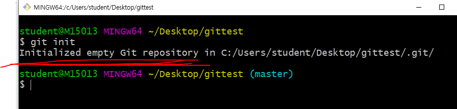


* Git 이 있고 그 하위디렉토리에 Git이 되어있으면 꼬인다.
* 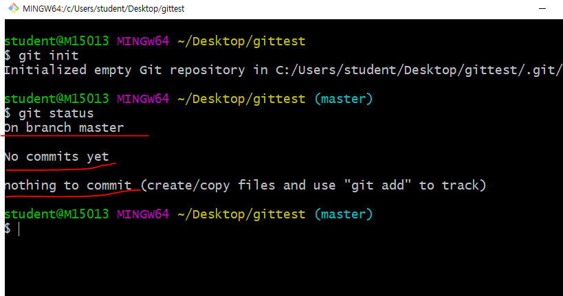


* `touch 생성할파일명` : 파일이 생성된다.

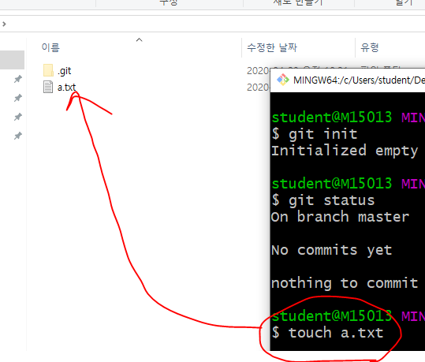


## Git Status를 통해 정리하기

### 기초 명령어

```bash
# list (파일 목록)
$ ls

#change directory (디렉토리 변경)
$ cd

#빈 파일 생성
$ touch <파일명>

```


### 상황

#### 1. `add`

```bash
$ touch a.txt
$ git status
On branch master

No commits yet
# 트래킹이 되고 있지 않은 파일 : 새로 생성된 파일
Untracked files:
	# 커밋을 하기 위한 곳에 포함시키려면 
	# Staging area로 이동시키려면, git add
  (use "git add <file>..." to include in what will be committed)
        a.txt

# 위 내용에 대한 총평 : WD에 새 파일은 존재하나, Staging area에는 없다.
nothing added to commit but untracked files present (use "git add" to track)

```


```bash
$ git add a.txt
$ git status

On branch master

No commits yet
# 커밋될 변경사항들 (stating area O)
Changes to be committed:
	#unstage를 위해서 활용할 명령어(add 취소)
  (use "git rm --cached <file>..." to unstage)
        new file:   a.txt

```


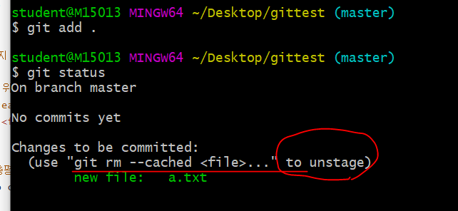

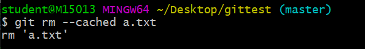


* 커밋

```bash
$ git commit -m 'Create a.txt'
[master (root-commit) 6d219df] Create a.txt
 1 file changed, 0 insertions(+), 0 deletions(-)
 create mode 100644 a.txt
```


* 커밋 내역 확인

  ```bash
  $ git log
  commit 6d219df597c2ebc59a951bd7cc9b7106e101ec93 (HEAD -> master)
  Author: snowcuphea <snowcuphea@gmail.com>
  Date:   Thu Apr 23 10:34:30 2020 +0900
  
  
  $ git log --oneline
  6d219df (HEAD -> master) Create a.txt
  
  
  ```


---


#### 3. 추가 파일 변경 상태

* a.txt 파일 수정 후 저장

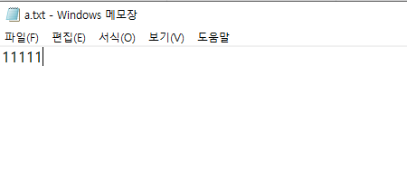

```bash
$ touch b.txt

student@M15013 MINGW64 ~/Desktop/gittest (master)
$ git status
On branch master
Changes not staged for commit:
  (use "git add <file>..." to update what will be committed)
  (use "git restore <file>..." to discard changes in working directory)
        modified:   a.txt

Untracked files:
  (use "git add <file>..." to include in what will be committed)
        b.txt

no changes added to commit (use "git add" and/or "git commit -a")
```


* rm --cached 를 하면 한 파일만 삭제되므로, git add 를 취소하려면 `git restore --staged` 로 하는 것이 좋다. 

```bash
$ git add .

student@M15013 MINGW64 ~/Desktop/gittest (master)
$ git status
On branch master
Changes to be committed:
  (use "git restore --staged <file>..." to unstage)
        modified:   a.txt
        new file:   b.txt

```


#### 4. 커밋 취소 , 커밋 메세지 변경

> **주의!!** 커밋 메시지 변경 시 해시값 자체가 변경되어, 이미 원격저장소에 push한 이력에 대해서 메시지 변경을 하면 안된다. 

```bash
$ git commit --amend
```

* `vim` 텍스트 편집기가 실행된다.
  * `i` : 편집 모드
  * `esc` : 편집 모드를 종료하고, 명령모드에서 저장
    * `:wq` 
      * write + quit


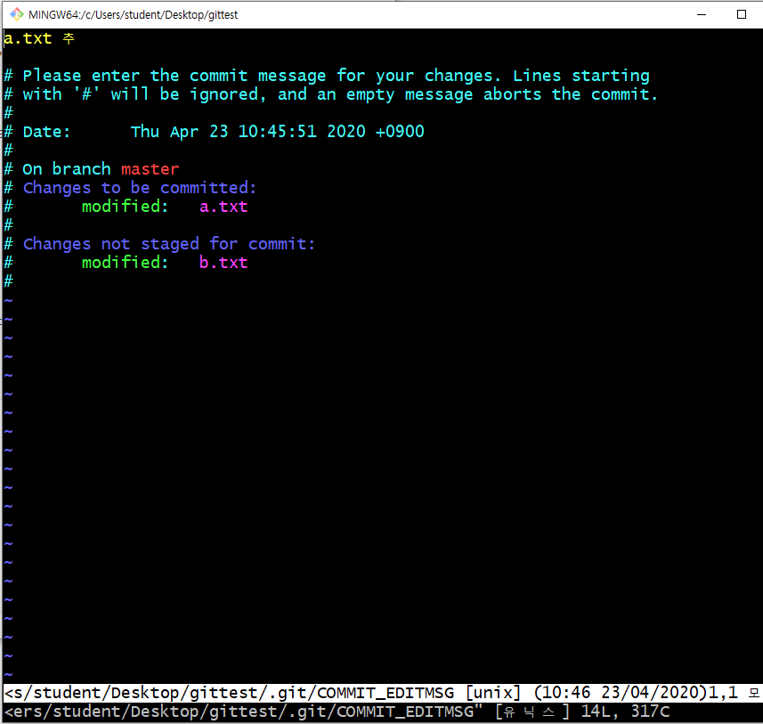

* i 를 누르고 수정할 수 있다.

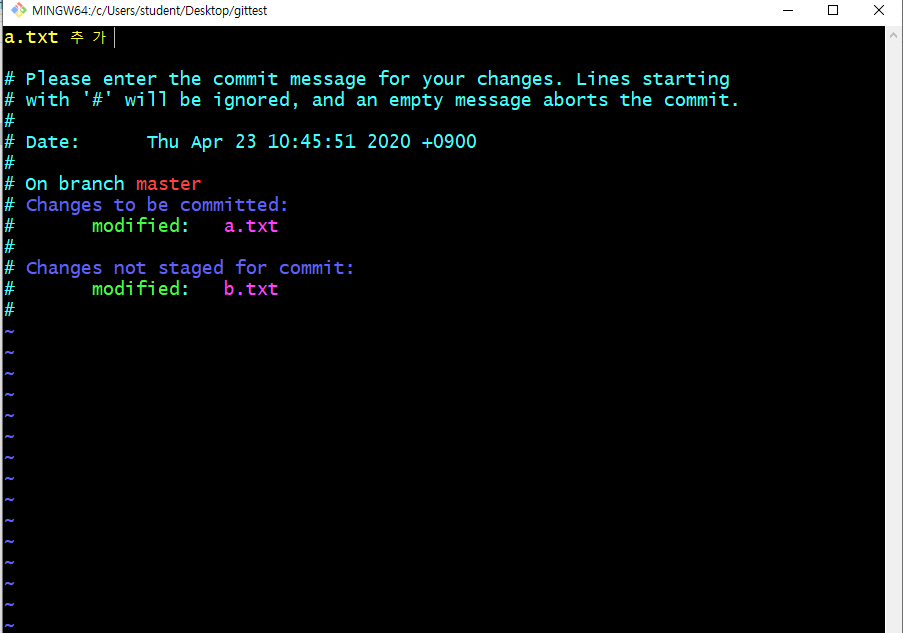


* 종료하려면 esc 누르고 `:` `w` `q` 를 순서대로 누르면 된다.

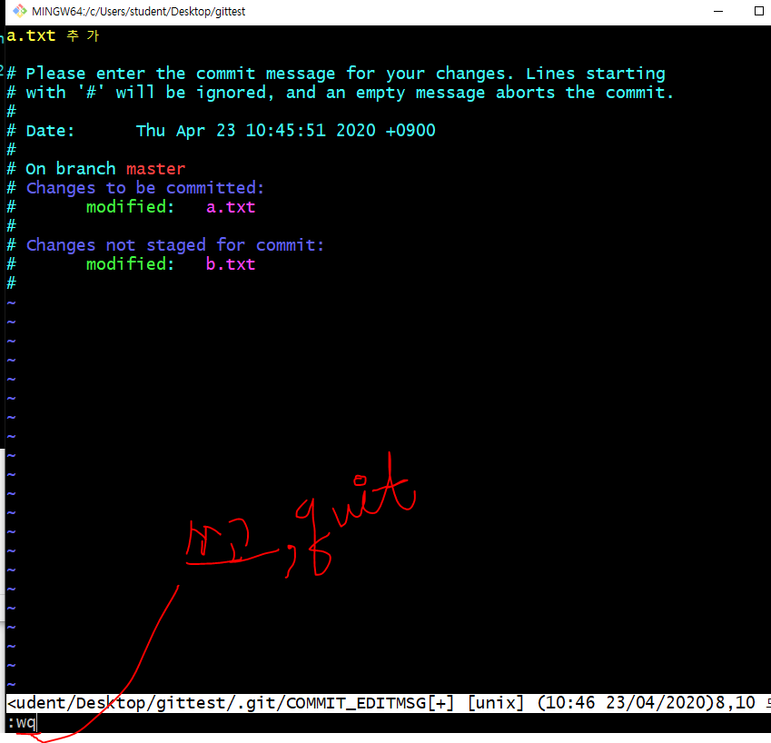


* amend는 커밋하기 직전 시점으로 돌린다. 


#### 4-1. 특정 파일을 빼놓고 커밋했을 때

```bash
$ git add <omit_file>
$ git commit --amend
```

* 빠뜨린 파일을 add한 이후에 `commit --amend` 를 하면, 해당 파일까지 포함하여 재커밋이 이뤄진다.


#### 5. 작업 내용을 이전 버전으로 되돌리기

* a.k.a 작업하던 내용 버리고 이전 버전의 모습으로 되돌릴 때


```bash
$ git restore 복원할파일명
```


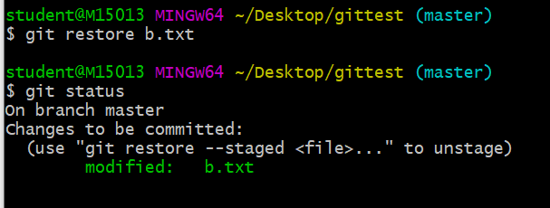


rm --cached : 커밋 이력에 들어가있던 거를 삭제

물리적인 파일이 삭제되진 않는다. 


#### 6. 특정 파일/폴더 삭제 커밋

> 해당 명령어는 실제 파일이 삭제되는 것은 아니지만, git에서 삭제되었다라는 이력을 남기는 것.

```bash
$ git rm --casched b.txt

Changes to be committed:
  (use "git restore --staged <file>..." to unstage)
        deleted:    b.txt

Untracked files:
  (use "git add <file>..." to include in what will be committed)
        b.txt


# 주의!! 해당 파일이 물리적으로 삭제 되는 것은 아니다.
```


* 일반적으로는 `.gitignore`와 함께 활용한다.

  1. `.gitignore` 에 해당 파일 등록
  2. `git rm --cahed` 를 통해 삭제 커밋

  * 이렇게 작업을 하면, 실제 파일은 삭제되지 않지만 이후로 git으로 전혀 관리되지 않는다. 
  * 

* 민감하고 공개되면 안되는 정보(프로젝트, 아이디어 등등)를 ignore해야 한다.
  
* git ignore 만들어 주는 사이트 :  http://gitignore.io/
  
* 이미 tracking 되고 있는 폴더나 파일에 대하여, rm cached 해서 이력을 제거하고, ignore파일로 관리하면 된다. 


# .gitignore

* git으로 관리하고 싶지 않은 파일을 등록하여 활용할 수 있다.
* 일반적으로 프로젝트 환경(IDE, OS 등)에 관련된 정보나 추가적으로 공개되면 안되는 데이터 파일 등을 설정하다.
* 일반 프로젝트 환경에 대한 정보는 우선 [gitignore.io](http://gitignore.io) 에서 프로젝트 시작할 때마다 정의하는 습관을 가지자.


```bash
# 특정파일
secret.csv

# 특정폴더
idea/

# 특정 확장자
*.csv

# 특정 폴더에서 특정 파일 빼고 (idea라는 폴더에서 a.txt는 깃으로 관리하고 싶을 때 => '!' 활용)
!idea/a.txt
```


### push


* 원격저장소에 추가하기

git remote add origin url : 깃아 원격저장소에 추가해줘 오리진이라고 url을

* 원격저장소에서 제거하기

  git remote rm origin


git push origin master


## 원격 저장소 활용 명령어

1. 원격 저장소 목록 조회

   ```bash
   $git remote -v
   ```

2. 원격 저장소 설정 삭제

   ```bash
   $ git remote rm {원격저장소이름}
   ```

3. 원격 저장소 설정

   ```bash
   $ git remote add origin {URL}
   ```

   